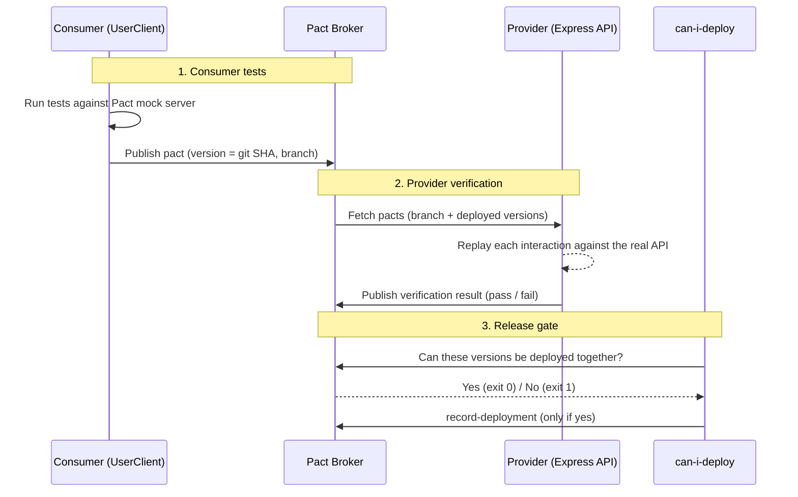

# Pact Contract Testing Demo

Consumer-driven contract testing with [@pact-foundation/pact](https://github.com/pact-foundation/pact-js) v16, a self-hosted [Pact Broker](https://docs.pact.io/pact_broker), and a `can-i-deploy` release gate running in GitHub Actions.

No accounts or sign-ups are needed. The broker is the open-source Pact Broker, run in Docker locally and in CI.

## How it works



The consumer defines the contract. The provider proves it honours it. The broker stores both, and `can-i-deploy` asks the broker whether a version is safe to release. A contract break stops the deploy, not just a test run.

## Project structure

```
pact-demo/
├── .github/
│   └── workflows/
│       └── contract-tests.yml           # CI: broker, publish, verify, gate, deploy
├── docker-compose.yml                   # Pact Broker + Postgres (local and CI)
├── consumer/
│   └── src/
│       ├── client.js                    # UserClient — axios wrapper
│       └── tests/
│           └── consumer.pact.test.js    # Generates the pact file
├── api/
│   └── src/
│       ├── app.js                       # Express app
│       ├── server.js                    # Starts the server on port 3001
│       └── tests/
│           └── provider.verify.test.js  # Verifies the pact (local file or broker)
└── pacts/
    └── UserConsumer-UserProvider.json   # Created after running consumer tests
```

## Requirements

- Node.js 20+
- npm
- Docker with the Compose plugin (for the broker)

## Quick start: file-only mode

The simplest loop, with no broker: the consumer writes a pact file and the provider reads it directly.

```bash
cd consumer && npm install && npm run test:pact && cd ..
cd api && npm install && npm run test:pact && cd ..
```

The pact file is written to `pacts/UserConsumer-UserProvider.json` at the repo root. The output location is configured in `consumer/src/tests/consumer.pact.test.js`:

```js
const provider = new PactV3({
  consumer: 'UserConsumer',
  provider: 'UserProvider',
  dir: path.resolve(__dirname, '../../../pacts'), // ← output directory
});
```

## Full flow: broker and release gate

This is how contract testing works across real teams. Consumer and provider are built and deployed separately, so they exchange contracts through the broker.

### 1. Start the broker

From the repo root:

```bash
docker compose up -d
```

Open http://localhost:9292. The broker UI loads with an example pact, which is seeded sample data you can ignore.

### 2. Publish the consumer's pact

From `consumer/`:

```bash
npm install
npm run test:pact
npx pact-broker publish ../pacts \
  --consumer-app-version $(git rev-parse --short HEAD) \
  --branch $(git rev-parse --abbrev-ref HEAD) \
  --broker-base-url http://localhost:9292
```

The Pact CLI (`@pact-foundation/pact-cli`) is a dev dependency of the consumer, so all `npx pact-broker` commands run from `consumer/`.

### 3. Verify the provider against the broker

From `api/`:

```bash
npm install
PACT_BROKER_BASE_URL=http://localhost:9292 \
GIT_COMMIT=$(git rev-parse --short HEAD) \
GIT_BRANCH=$(git rev-parse --abbrev-ref HEAD) \
npm run test:pact
```

When `PACT_BROKER_BASE_URL` is set, `provider.verify.test.js` switches to broker mode. It:

- fetches pacts using consumer version selectors: the latest pact on the same branch, plus any consumer version currently deployed or released
- verifies them against the real API
- publishes the result back to the broker, tagged with `GIT_COMMIT` and `GIT_BRANCH`

Without `PACT_BROKER_BASE_URL`, it reads the local pact file as in file-only mode.

### 4. Ask the gate, then record the deployment

From `consumer/`:

```bash
npx pact-broker can-i-deploy \
  --pacticipant UserConsumer --version $(git rev-parse --short HEAD) \
  --pacticipant UserProvider --version $(git rev-parse --short HEAD) \
  --broker-base-url http://localhost:9292
```

```
│ UserConsumer ┆ 77645ea ┆ UserProvider ┆ 77645ea ┆ true ┆ 1 │

All required verification results are published and successful

✅ Computer says yes \o/
```

Record both as deployed to production. The `production` and `test` environments are seeded by the broker.

```bash
npx pact-broker record-deployment --pacticipant UserProvider --version $(git rev-parse --short HEAD) --environment production --broker-base-url http://localhost:9292
npx pact-broker record-deployment --pacticipant UserConsumer --version $(git rev-parse --short HEAD) --environment production --broker-base-url http://localhost:9292
```

From here on, the broker knows what's running in production and can check any new version against it.

## Breaking the contract (try it)

In `api/src/app.js`, rename the `email` field in the `GET /users/:id` handler:

```js
// Change:
res.json(user);
// To:
res.json({ ...user, emailAddress: user.email, email: undefined });
```

Verify this as a new provider version (from `api/`):

```bash
PACT_BROKER_BASE_URL=http://localhost:9292 GIT_COMMIT=broken-1 GIT_BRANCH=break-email npm run test:pact
```

The API still responds normally (200, correct headers), but the contract is broken:

```
1) Verifying a pact between UserConsumer and UserProvider Given user with id 1 exists - a request for user with id 1
    1.1) has a matching body
           $ -> Actual map is missing the following keys: email
```

The failure is published to the broker. Now ask whether this provider can go to production (from `consumer/`):

```bash
npx pact-broker can-i-deploy --pacticipant UserProvider --version broken-1 --to-environment production --broker-base-url http://localhost:9292
```

```
│ UserConsumer ┆ 77645ea ┆ UserProvider ┆ broken-1 ┆ false ┆ 1 │

The verification for the pact between the version of UserConsumer currently in production (77645ea) and version broken-1 of UserProvider failed

❌ Computer says no ¯\_(ツ)_/¯
```

Exit code 1. In a pipeline, that stops the deploy. The provider can't ship while a consumer in production still depends on `email`.

Revert the change to `res.json(user);` afterwards.

## CI: GitHub Actions

`.github/workflows/contract-tests.yml` runs the full flow on every push to `main`, every pull request, and on demand (`workflow_dispatch`):

| Step | What it does |
|---|---|
| Start Pact Broker | `docker compose up -d` using the same `docker-compose.yml` as local, then waits for the broker heartbeat |
| Consumer | Runs consumer tests and publishes the pact, versioned by commit SHA and branch |
| Provider | Verifies against the broker and publishes the result. Marked `continue-on-error` so the gate makes the release decision. |
| Gate | `can-i-deploy` for this commit's consumer and provider versions. A failed verification fails the run here. |
| Deploy (simulated) | Runs only if the gate passes. Records both versions as deployed to production. |
| Upload reports | Attaches `api/reports/` (HTML and JUnit) to the run as an artifact, pass or fail |

The broker in CI is ephemeral: it starts empty on each run. That's why the CI gate checks the consumer and provider versions against each other (`--pacticipant` twice) rather than `--to-environment production`. There is no production history to check against.

Because no accounts or secrets are involved, anyone who forks the repo can run the workflow unchanged.

## Run the API manually (optional)

```bash
cd api && npm start
```

```bash
curl http://localhost:3001/users
curl http://localhost:3001/users/1
curl http://localhost:3001/users/999        # → 404
curl -X POST http://localhost:3001/users \
  -H 'Content-Type: application/json' \
  -d '{"name":"Dave","email":"dave@example.com","role":"user"}'
```

## Anatomy of a consumer test

Each test registers one interaction: a request the consumer will make and the response it expects back. Here is the `GET /users/:id` example:

```js
await provider
  .addInteraction({
    states: [{ description: 'user with id 1 exists' }],  // (1)
    uponReceiving: 'a request for user with id 1',        // (2)
    withRequest: {                                        // (3)
      method: 'GET',
      path: '/users/1',
    },
    willRespondWith: {                                    // (4)
      status: 200,
      headers: { 'Content-Type': 'application/json' },
      body: like({
        id: integer(1),                 // must be an integer
        name: string('Alice'),          // must be a string
        email: string('alice@example.com'),
        role: string('admin'),
      }),
    },
  })
  .executeTest(async (mockServer) => {                    // (5)
    const client = new UserClient(mockServer.url);
    const user = await client.getUser(1);

    expect(user.id).toBe(1);
    expect(typeof user.name).toBe('string');
  });
```

| # | What it does |
|---|---|
| 1 | **Provider state**: a named condition the provider must set up before this interaction runs (e.g. seed the database). Handled in `provider.verify.test.js` via `stateHandlers`. |
| 2 | **Description**: a human-readable label that identifies this interaction in the pact file. |
| 3 | **Request**: the exact HTTP request the consumer will send. |
| 4 | **Response**: what the consumer expects back. Uses matchers (`like`, `integer`, `string`), so the provider is tied to shapes and types, not exact values. |
| 5 | **executeTest**: runs the real `UserClient` against the Pact mock server and asserts the client handles the response correctly. |

## Reports

Reports are generated only by the **provider verification** step (`api/`). There is no report on the consumer side, because the consumer tests don't verify anything about the real API. They only generate the pact file.

After running `npm run test:pact` in `api/`, two files are written to `api/reports/`:

| File | Format | Purpose |
|---|---|---|
| `reports/test-report.html` | HTML | Human-readable: open in a browser to see pass/fail, durations, and full failure diffs |
| `reports/junit.xml` | JUnit XML | Machine-readable: consumed by CI systems to display test results and track trends |

In CI, both are uploaded as the `pact-reports` artifact on every run.

Both are configured in the `"jest"` block of `api/package.json`:

```json
"jest": {
  "reporters": [
    "default",
    ["jest-html-reporter", {
      "outputPath": "./reports/test-report.html",
      "pageTitle": "Provider Pact Verification",
      "includeFailureMsg": true
    }],
    ["jest-junit", {
      "outputDirectory": "./reports",
      "outputName": "junit.xml"
    }]
  ]
}
```

## Key concepts

| Term | Meaning |
|---|---|
| **Consumer** | Code that calls the API (`UserClient`) |
| **Provider** | Code that serves the API (Express app) |
| **Pact file** | JSON contract listing every expected interaction |
| **Mock server** | Pact-managed server that stands in for the provider during consumer tests |
| **Provider states** | Named setup conditions (e.g. `"user with id 1 exists"`) used to seed data before each interaction |
| **Matchers** | `like()`, `eachLike()`, `integer()`, `string()`: match by type/shape rather than exact value |
| **Pact Broker** | Shared store for pacts and verification results, so separately built services can exchange contracts |
| **Consumer version selectors** | Rules the provider uses to choose which pacts to verify (e.g. same branch, currently deployed) |
| **can-i-deploy** | Broker query that returns exit 0/1: has this version been verified against what it will run alongside? |
| **record-deployment** | Tells the broker which version is live in an environment, so future `can-i-deploy` checks are accurate |
| **Environment** | A deployment target known to the broker (`test` and `production` are seeded by default) |
