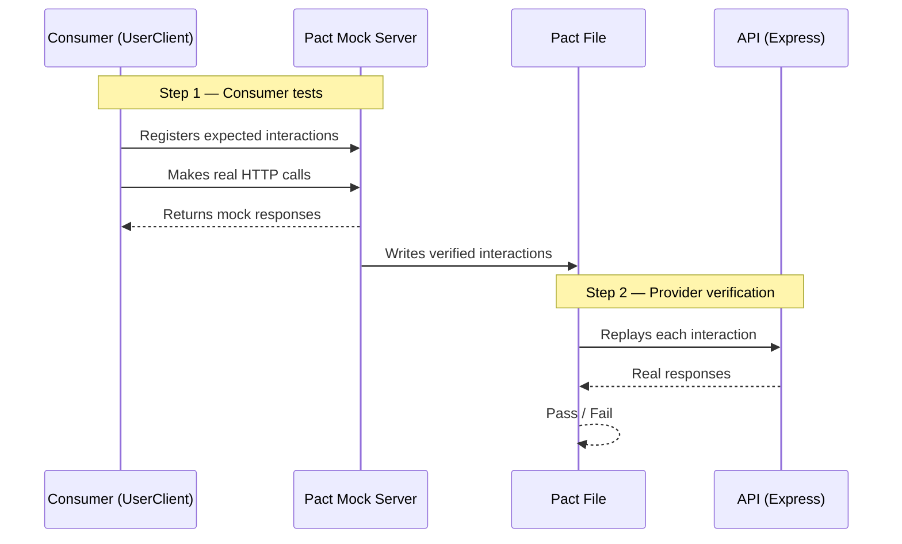

# Pact Contract Testing Demo

Consumer-driven contract testing with [@pact-foundation/pact](https://github.com/pact-foundation/pact-js) v16.

## How it works



## Project structure

```
pact-demo/
├── consumer/
│   └── src/
│       ├── client.js                    # UserClient — axios wrapper
│       └── tests/
│           └── consumer.pact.test.js    # Generates the pact file
├── api/
│   └── src/
│       ├── app.js                       # Express app
│       ├── server.js                    # Starts the server on port 3001
│       └── tests/
│           └── provider.verify.test.js  # Replays pact against the real API
└── pacts/
    └── UserConsumer-UserProvider.json   # Created after running consumer tests
```

## Requirements

- Node.js 20+
- npm

## Usage

### 1. Install dependencies

```bash
cd consumer && npm install && cd ..
cd api && npm install && cd ..
```

### 2. Run consumer tests

```bash
cd consumer && npm run test:pact
```

This writes the pact file to `pacts/UserConsumer-UserProvider.json` at the repo root. The output location is configured in `consumer/src/tests/consumer.pact.test.js`:

```js
const provider = new PactV3({
  consumer: 'UserConsumer',
  provider: 'UserProvider',
  dir: path.resolve(__dirname, '../../../pacts'), // ← output directory
});
```

### 3. Verify the provider against the pact

```bash
cd api && npm run test:pact
```

### 4. Run the API manually (optional)

```bash
cd api && npm start
```

```bash
curl http://localhost:3001/users
curl http://localhost:3001/users/1
curl http://localhost:3001/users/999        # → 404
curl -X POST http://localhost:3001/users \
  -H 'Content-Type: application/json' \
  -d '{"name":"Dave","email":"dave@example.com","role":"user"}'
```

## Anatomy of a consumer test

Each test registers one interaction — a request the consumer will make and the response it expects back. Here is the `GET /users/:id` example:

```js
await provider
  .addInteraction({
    states: [{ description: 'user with id 1 exists' }],  // (1)
    uponReceiving: 'a request for user with id 1',        // (2)
    withRequest: {                                        // (3)
      method: 'GET',
      path: '/users/1',
    },
    willRespondWith: {                                    // (4)
      status: 200,
      headers: { 'Content-Type': 'application/json' },
      body: like({
        id: integer(1),                 // must be an integer
        name: string('Alice'),          // must be a string
        email: string('alice@example.com'),
        role: string('admin'),
      }),
    },
  })
  .executeTest(async (mockServer) => {                    // (5)
    const client = new UserClient(mockServer.url);
    const user = await client.getUser(1);

    expect(user.id).toBe(1);
    expect(typeof user.name).toBe('string');
  });
```

| # | What it does |
|---|---|
| 1 | **Provider state** — a named condition the provider must set up before this interaction runs (e.g. seed the database). Handled in `provider.verify.test.js` via `stateHandlers`. |
| 2 | **Description** — a human-readable label that identifies this interaction in the pact file. |
| 3 | **Request** — the exact HTTP request the consumer will send. |
| 4 | **Response** — what the consumer expects back. Uses matchers (`like`, `integer`, `string`) so the provider isn't tied to exact values, only shapes and types. |
| 5 | **executeTest** — runs the real `UserClient` against the Pact mock server and asserts the client handles the response correctly. |

## Reports

Reports are only generated by the **provider verification** step (`api/`). There is no report on the consumer side because the consumer tests don't verify anything about the real API — they only generate the pact file. If they pass, the file exists; that's the only output that matters.

The provider verification is where the contract is actually tested, so that's where reporting is useful. After running `npm run test:pact` in `api/`, two files are written to `api/reports/`:

| File | Format | Purpose |
|---|---|---|
| `reports/test-report.html` | HTML | Human-readable — open in a browser to see pass/fail, durations, and full failure diffs |
| `reports/junit.xml` | JUnit XML | Machine-readable — consumed by CI systems (GitHub Actions, Jenkins, GitLab CI) to display test results and track trends |

Both are configured in the `"jest"` block of `api/package.json`:

```json
"jest": {
  "reporters": [
    "default",
    ["jest-html-reporter", {
      "outputPath": "./reports/test-report.html",
      "pageTitle": "Provider Pact Verification",
      "includeFailureMsg": true
    }],
    ["jest-junit", {
      "outputDirectory": "./reports",
      "outputName": "junit.xml"
    }]
  ]
}
```

## Breaking the contract (try it)

In `api/src/app.js`, rename the `email` field in the `GET /users/:id` handler:

```js
// Change:
res.json(user);
// To:
res.json({ ...user, email: undefined, emailAddress: user.email });
```

Re-run `npm run test:pact` in `api/` — Pact will fail with a diff showing exactly which fields are missing.

## Key concepts

| Term | Meaning |
|---|---|
| **Consumer** | Code that calls the API (`UserClient`) |
| **Provider** | Code that serves the API (Express app) |
| **Pact file** | JSON contract listing every expected interaction |
| **Mock server** | Pact-managed server that stands in for the provider during consumer tests |
| **Provider states** | Named setup conditions (e.g. `"user with id 1 exists"`) used to seed data before each interaction |
| **Matchers** | `like()`, `eachLike()`, `integer()`, `string()` — match by type/shape rather than exact value |
